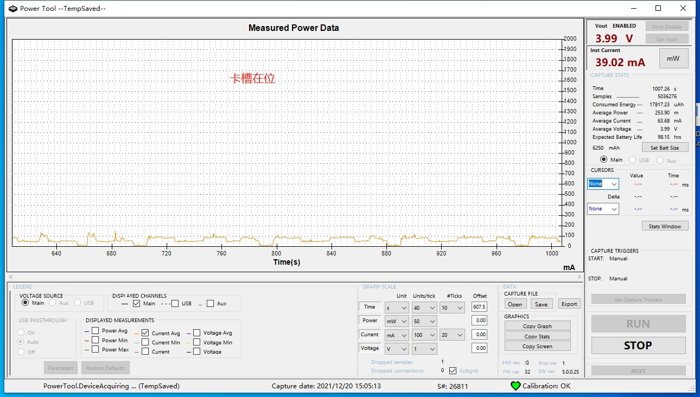
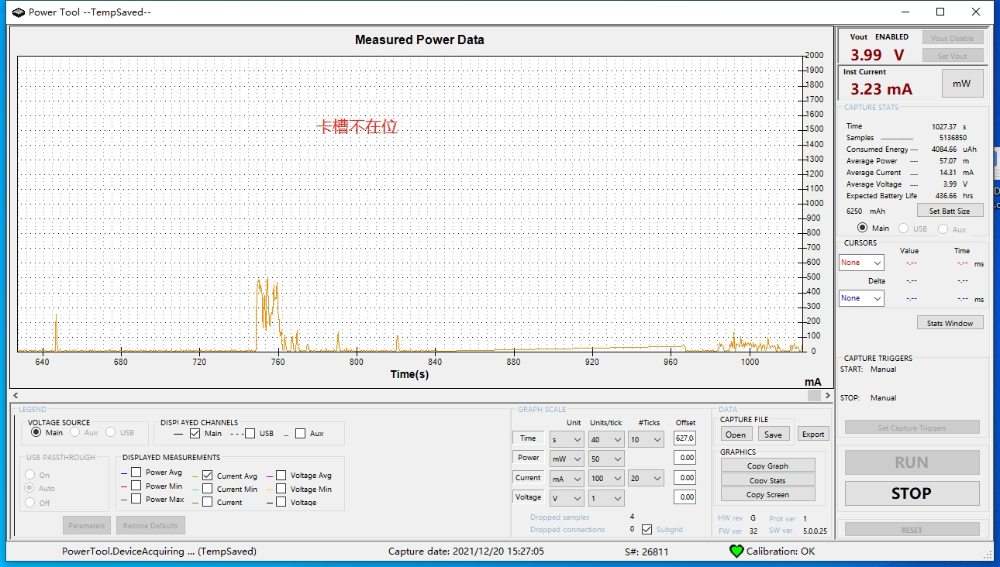
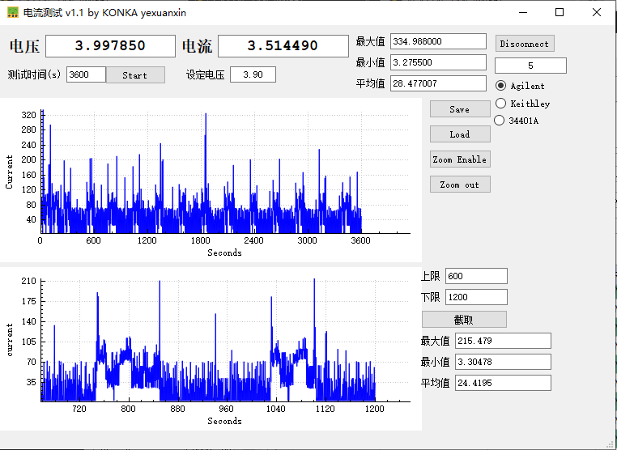

# 概述

Esim休眠功耗大问题分析。

## AT指令解释


## 问题描述

* 1.esim上电休眠，待机15分钟平均功耗为63.68ma：



* 2.esim下电休眠，待机15分钟平均功耗为14.31ma：



## 初步结论

机功耗异常原因主要是欧亚版本esim在上电后，没有做低功耗模式，系统不断搜网造成。

## MTK分析结论

```diff
Dear Customer,

贵司的期望行为是  手机插卡灭屏的情况下的功耗 要保持和 手机没插卡的功耗一致。
	实际结果是   手机插卡灭屏的情况下的功耗比较大，导致续航时间短。 主要原因是手机插卡灭屏的情况下 modem仍然处于激活驻网状态，导致手机整体功耗比较高。
	而手机没插SIM卡时候 modem不处于驻网状态功耗较低。、
-> 现在是MTK modem侧回复，两种场景无法等同，因为既然有卡信息，在radio on的情况下，就会进行搜网以进行快速恢复正常服务或限制服务状态，以实际搜网结果为准。而不插卡的时候，modem也会进行搜网，以获取限制服务时，可以进行紧急电话。
两种情况都不会停止搜网，除非radio off。针对测试来看，当前搜不到网络进行recovery search，可以进行period of timer的客制化修改，可以定义每一次fullband的间隔时间，以降低功耗。

Type	Index	Time	Local Time	Module	TraceType	Message	Comment	Time Differences
PS	17441	2257969546	09:27:56:034	EVAL - NWSEL		MSG_ID_NWSEL_EVAL_PLMN_SEARCH_CNF		
PS	17442	2257969547	09:27:56:034	NWSEL		[NWSEL][PLMN Search CNF] result: PLMN_NOT_FOUND, rat: RAT_LTE, scan_type: FULL_BAND, multi_selected_plmn[0]: 000000		
PS	67644	2258082994	09:28:03:488	NWSEL		NWSEL_RECOVERY_TIMER_ID Timer expires when current is action NWSEL_COMM_NO_ACTION		
PS	193534	2258812133	09:28:50:139	NWSEL		NWSEL_RECOVERY_TIMER_ID Timer starts, period = 10 seconds		
PS	197247	2258968384	09:29:00:153	NWSEL		NWSEL_RECOVERY_TIMER_ID Timer expires when current is action NWSEL_COMM_NO_ACTION		

客制化：

/mcu/custom/service/nvram/nas_nvram_def.c

经过确认要在nv里做客制化

-       以底下為例: 1~6次的fullband間隔為20s, 7~12次的fullband間隔為30s, ...

-        

-      in nas_nvram_def.c

-      NV ID: NVRAM_EF_NWSEL_DATA_LID

-       

-       #ifdef __SGLTE__

-           0xC8,  /*1, 180s, give the enough timer to sniffer @CMCC case 4.3.3/4.1.3*/

-       #else

-           0xC8,  /*1, 20s*/

-       #endif

-           0xC8,  /*2, 20s*/

-       #ifdef __NWSEL_QUICK_SEARCH_FOR_ROAMING__ 

-           0xC8,  /*3, 20s*/

-           0xC8,  /*4, 20s*/

-           0xC8,  /*5, 20s*/

-           0xC8,  /*6, 20s*/

-           0xC8,  /*7, 30s*/

-           0xC8,  /*8, 30s*/

-           0xC8,  /*9, 30s*/

-           0xC8,  /*10, 30s*/

-           0xC8,  /*11, 30s*/

-           0xC8,  /*12, 30s*/

-           0xC8,  /*13, 60s*/


-           0xC8,  /*14, 60s*/

改完nas_nvram_def.c後記得要在nas_nvram_def.h將#define  NVRAM_EF_NWSEL_DATA_LID_VERNO 加1


Brs,
MediaTek Support
```

## 测试

### 1.modem扫描全部改为360s

* 1.使用`ETESTSIM=0`测试结果如下：


* 2.使用`ETESTSIM=1`测试结果如下：


### 2.前三次时间缩短

* 1.扫描周期280s左右。



## 软件修改

### 1.增加AT指令

systool 程序流程如下：

```
telcore/client/RilOemClient.cpp
* RilClient::RilClient(int identity, char* socketName) {
  * activityThread = new StateActivityThread(this);
  * activityThread->run("StateThread");
    * bool RilClient::StateActivityThread::threadLoop() {  跑线程
      * while(1) {
      * client->clientStateCallback();  
        * switch(clientState) {
        * case CLIENT_ACTIVE:
        * handleStateActive();
          * int result = handleSpecialRequestWithArgs(number, args);
           * else if (strcmp(cmd, "SYSTOOL") == 0) {
             * executeSystool(orgArgs);
               * else if(strcmp(subCmd, "AT+MODEMVERSION?") == 0){ 发送AT指令
                 * rfx_enqueue_request_message_client(RFX_MSG_REQUEST_READ_MODEMVERISON,
```