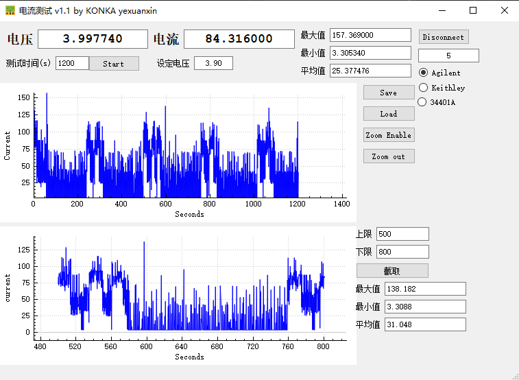
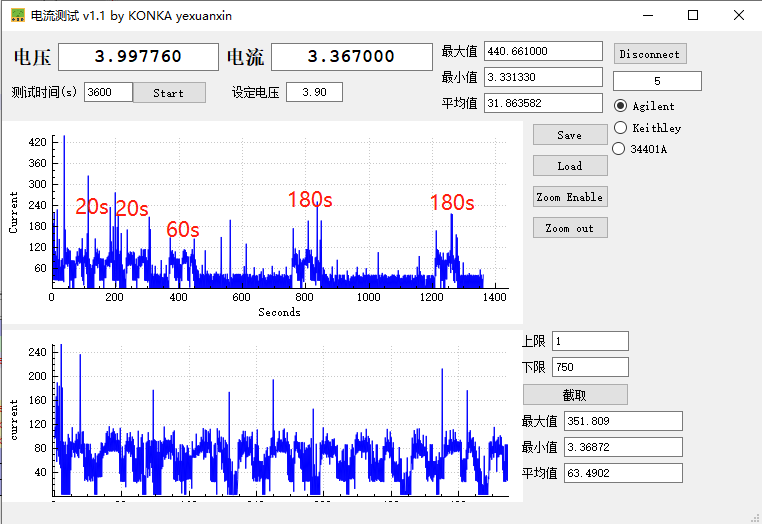
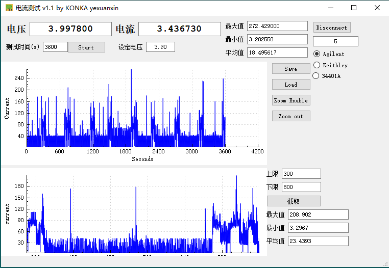
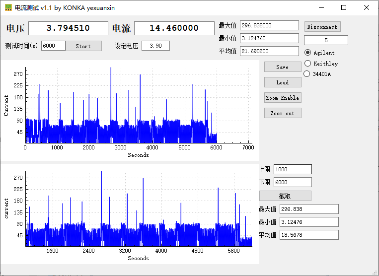

# 概述

Esim休眠功耗大问题分析。

## 参考

* [[FAQ19628] [SIM]怎样判别是否为“白卡”（测试卡）](https://online.mediatek.com/FAQ#/SW/FAQ19628)

```
“白卡”中有些文件内容会有一些特殊规定用于标识“白卡”的身份:
A：MCC-MNC = 001-01
B：EF_AD文件中的 ms_operation 的值为0x80/0x81/0x02/0x04
我们在读取EF_AD的时候会将之前读出的MCC/MNC满足情况一并做“白卡”判断，判断条件的关系有A&&B和A||B两种，判断条件的关系在test_sim_relation()中定义，若需要修改判断关系（&&或者||）直接修改此函数的return值即可，返回0对应||、返回1对应&&；
判断结果存放在SIM的全局context中（this_sim->is_test_sim），客户可调用is_test_sim()接口获得判断结果，参数为想获得信息的SIM编号：0x00/0x01/0x02/0x03分别对应SIM1、SIM2、SIM3、SIM4。
 
1、其中ms_operation==0x80/0x81/0x02/0x04 分别代表什么含义呢？
参考spec 3GPP TS 31.102 ：EFAD (Administrative data)
This EF contains information concerning the mode of operation according to the type of USIM, such as normal (to be used by PLMN subscribers for 3G operations), type approval (to allow specific use of the ME during type approval procedures of e.g. the radio equipment), cell testing (to allow testing of a cell before commercial use of this cell), manufacturer specific (to allow the ME manufacturer to perform specific proprietary auto-test in its ME during e.g. maintenance phases).

MS operation mode
Contents: mode of operation for the MS
Coding: Initial value
- normal operation '00'
- type approval operations '80'
- normal operation + specific facilities '01'
- type approval operations + specific facilities '81'
- maintenance (off line) '02'
- cell test operation '04'
 
2、MCC-MNC = 001-01 ，此条规则参考自哪个spec呢？
参考的spec：3GPP TS 51.010
Definition of default values for SIM Application Toolkit testing
EFIMSI (International Mobile Subscriber Identity)
Logically:
Length: 8 bytes
IMSI: 001 01 0123456789
```

## 调试

* 如何判断是否是白卡(test sim):

```
1.AP端可以获取对应SIM卡的属性值进行判断，0表示普通SIM卡，1表示测试卡。

"gsm.sim.ril.testsim",    --- 卡1
"gsm.sim.ril.testsim.2", --- 卡2
"gsm.sim.ril.testsim.3", --- 卡3
"gsm.sim.ril.testsim.4", --- 卡4

2.AT+ETESTSIM?指令查询
0 normal sim
1 test sim

AT+ETESTSIM?
+ETESTSIM: 0
OK

3.ELT log分析：
Type	Index	Time	Local Time	Module	TraceType	Message	Comment	Time Differences
PS	48686	63289	19:25:53:181	SIM		SELECT:FILE_U_AD_IDX => 90 00		
PS	48687	63290	19:25:53:181	SIM		sim_al_read_binary()		
PS	48689	63290	19:25:53:181	SIM		SIM_READ_BINARY : length: 5		
PS	48690	63290	19:25:53:181	SIM		APDU_tx 0: 00 B0 00 00 04 F2 F2 F2 F2 4B F2 F2 F2 F2 3A 20		
PS	48952	63411	19:25:53:181	SIM		SIM_CACHE_FILE_AD_IDX [0]: length: 4		
PS	48953	63412	19:25:53:181	SIM		ADM_WDATA 0: 00 00 00 02 FF FF F2 F2 F2 F2 F2 F2 F2 F2 49 44		
PS	48956	63412	19:25:53:181	SIM		APDU_rx 0: 00 00 00 02 F2 F2 F2 F2 F2 F2 F2 F2 F2 F2 4E 43		
PS	48957	63412	19:25:53:181	SIM		SIM: SIM_CMD_SUCCESS		
PS	48958	63412	19:25:53:181	SIM		READ BINARY  offset: 0 length: 4 => 90 00		
PS	51839	64250	19:25:53:381	SIM		[SIM] Normal sim 1		
PS	51840	64251	19:25:53:381	SIM		[SIM] not Test SIM, normal SIM inserted		
SYS	115558	291119	19:26:07:764	NIL		[AT_RX p56,ch6]AT+ETESTSIM?		
SYS	115572	291129	19:26:07:764	NIL		[ATCI_AT_R_0 s11]+ETESTSIM: 0
```

## AT指令解释


## 问题描述

* 1.esim上电休眠，待机15分钟平均功耗为63.68ma：


* 2.esim下电休眠，待机15分钟平均功耗为14.31ma：


## 初步结论

机功耗异常原因主要是欧亚版本esim在上电后，没有做低功耗模式，系统不断搜网造成。

## MTK分析结论

```diff
Dear Customer,

贵司的期望行为是  手机插卡灭屏的情况下的功耗 要保持和 手机没插卡的功耗一致。
	实际结果是   手机插卡灭屏的情况下的功耗比较大，导致续航时间短。 主要原因是手机插卡灭屏的情况下 modem仍然处于激活驻网状态，导致手机整体功耗比较高。
	而手机没插SIM卡时候 modem不处于驻网状态功耗较低。、
-> 现在是MTK modem侧回复，两种场景无法等同，因为既然有卡信息，在radio on的情况下，就会进行搜网以进行快速恢复正常服务或限制服务状态，以实际搜网结果为准。而不插卡的时候，modem也会进行搜网，以获取限制服务时，可以进行紧急电话。
两种情况都不会停止搜网，除非radio off。针对测试来看，当前搜不到网络进行recovery search，可以进行period of timer的客制化修改，可以定义每一次fullband的间隔时间，以降低功耗。

Type	Index	Time	Local Time	Module	TraceType	Message	Comment	Time Differences
PS	17441	2257969546	09:27:56:034	EVAL - NWSEL		MSG_ID_NWSEL_EVAL_PLMN_SEARCH_CNF		
PS	17442	2257969547	09:27:56:034	NWSEL		[NWSEL][PLMN Search CNF] result: PLMN_NOT_FOUND, rat: RAT_LTE, scan_type: FULL_BAND, multi_selected_plmn[0]: 000000		
PS	67644	2258082994	09:28:03:488	NWSEL		NWSEL_RECOVERY_TIMER_ID Timer expires when current is action NWSEL_COMM_NO_ACTION		
PS	193534	2258812133	09:28:50:139	NWSEL		NWSEL_RECOVERY_TIMER_ID Timer starts, period = 10 seconds		
PS	197247	2258968384	09:29:00:153	NWSEL		NWSEL_RECOVERY_TIMER_ID Timer expires when current is action NWSEL_COMM_NO_ACTION		

客制化：

/mcu/custom/service/nvram/nas_nvram_def.c

经过确认要在nv里做客制化

-       以底下為例: 1~6次的fullband間隔為20s, 7~12次的fullband間隔為30s, ...

-        

-      in nas_nvram_def.c

-      NV ID: NVRAM_EF_NWSEL_DATA_LID

-       

-       #ifdef __SGLTE__

-           0xC8,  /*1, 180s, give the enough timer to sniffer @CMCC case 4.3.3/4.1.3*/

-       #else

-           0xC8,  /*1, 20s*/

-       #endif

-           0xC8,  /*2, 20s*/

-       #ifdef __NWSEL_QUICK_SEARCH_FOR_ROAMING__ 

-           0xC8,  /*3, 20s*/

-           0xC8,  /*4, 20s*/

-           0xC8,  /*5, 20s*/

-           0xC8,  /*6, 20s*/

-           0xC8,  /*7, 30s*/

-           0xC8,  /*8, 30s*/

-           0xC8,  /*9, 30s*/

-           0xC8,  /*10, 30s*/

-           0xC8,  /*11, 30s*/

-           0xC8,  /*12, 30s*/

-           0xC8,  /*13, 60s*/


-           0xC8,  /*14, 60s*/

改完nas_nvram_def.c後記得要在nas_nvram_def.h將#define  NVRAM_EF_NWSEL_DATA_LID_VERNO 加1


Brs,
MediaTek Support
```

## 测试

### 1.modem扫描全部改为360s

* 1.使用`ETESTSIM=0`测试结果如下：



* 2.使用`ETESTSIM=1`测试结果如下：


### 2.前三次时间缩短

* 1.扫描周期280s左右。


## 测试结论

* 1.其实上面的图都已经是real sim了，扫描周期修改，都有效。

```java
0 normal sim
1 test sim

AT+ETESTSIM?
+ETESTSIM: 0
OK
```

* 2.而且设置`ETESTSIM`的AT指令如下,设置完后不是立即生效的，需要重启并用AT指令查询。

```java
AT+ETESTSIM=2,0 : Treats TestSIM as TestSIM
AT+ETESTSIM=2,1 : Treats TestSIM same as Normal SIM
```

## 实测

* 1.当ETESTSIM为1时，也就是识别为TEST SIM，扫描周期是10s，无法修改，如下图：


* 2.当被识别成normal sim时，扫描周期使用`NVRAM_EF_NWSEL_DATA_LID`NV里的扫描周期，可修改，如下：


## 软件修改方案

* 我们这个是esim卡，是被modem识别成白卡(TEST SIM)了，而TEST SIM使用的10s recovery timer,也就是扫描周期为10s固定的，无法修改，需要将当前卡强制设置为real SIM，有以下几种方法。

### 1.增加modem AT指令

#### 1.软件架构

* 1.`telcore/client/RilOemClient.cpp`:Ril接收端`RilClient`程序流程如下：

``` java
* RilClient::RilClient(int identity, char* socketName) {
  * activityThread = new StateActivityThread(this);
  * activityThread->run("StateThread");
    * bool RilClient::StateActivityThread::threadLoop() {  跑线程收发socket通信
      * while(1) {
      * client->clientStateCallback();  
        * switch(clientState) {
        * case CLIENT_ACTIVE:
        * handleStateActive();
          * int result = handleSpecialRequestWithArgs(number, args);
           * else if (strcmp(cmd, "SYSTOOL") == 0) {
             * executeSystool(orgArgs); 解析systool指令
               * subCmd = line->atTokNextstr(&err);  AT cmd命令
               * else if(strcmp(subCmd, "AT+ETESTSIM=") == 0) 判断AT指令
                 * rfx_enqueue_request_message_client(RFX_MSG_REQUEST_WRITE_ESIMMODE,(void *) imeiOrBarcode, strlen(imeiOrBarcode), pRI,(RIL_SOCKET_ID) mainSlotId); 
```

* 2.systool发送socket端流程如下`paxdroid/system/core/bootinit/modemtool.cpp`：

```c
* main(int argc, char *argv[]){
  * main(int argc, char *argv[]){
    * write_esim_mode(ESIM_MODEM);
      * gISystoolServiceV1_0->setSystemConfig(ConfigType::ESIM_MODE, vec);
```

* 调用到systool interface接口如下`paxdroid/hardware/interfaces/systool/1.0/default/SystoolServer.cpp`：

```cpp
* Return<int32_t>  SystoolServer::setSystemConfig(ConfigType type, const hidl_vec<uint8_t>& value) {
  * case ConfigType::ESIM_MODE:
  * res = mDevice->set_esim_mode(mDevice, (const unsigned char*)value.data());
```

* `set_esim_mode`接口实现如下`paxdroid/system/core/systool/systool.c`：

```c
* static int systool_m_open(const hw_module_t* module, const char __unused *id,
  * dev->set_esim_mode = systool_set_esim_mode;

int32_t systool_set_esim_mode(struct systool_device *dev, const unsigned char *value) {
    char buf[SOCKET_RECV_LEN] = {0};

    ALOGD("set esim_mode %s\n",value);
	sprintf(buf, "SYSTOOL,AT+ETESTSIM=,%s", value);
    ALOGD("cmd = %s \n", buf);
    int32_t ret = send_to_ril(buf);  //socket发送
    ALOGD("ret = %d \n", ret);
    return ret;
}
```


* 打印如下：

```log
01-11 14:35:52.584  1050  1123 I RilClient: initialize: commandFd is 107
01-11 14:35:52.584  1050  1123 I RilOemClient: systool line = SYSTOOL,AT+ETESTSIM=,0, cmd:SYSTOOL, subCmd:AT+ETESTSIM=, slotId:0, targetSim: 0, imeiOrBarcode:0 arg : (null)
01-11 14:35:52.584  1050  1123 I RilOemClient: arg : (null)
01-11 14:35:52.585  1050  1123 I RilClient: start listen on fd: 26, socket name: rild-oem
01-11 14:35:52.585  1050  1075 E RmcOemHandler: requestWriteEsimMode Enter: AT+ETESTSIM=0
01-11 14:35:52.585  1050  1075 I AT      : [0] AT> AT+ETESTSIM=0 (RIL_CMD_READER_1 tid:504162471104)
```

最后发现这个是modem定制的AT指令才能用，太坑了。

#### 2.具体软件修改

* 1.systool修改如下：

```diff
diff --git a/paxdroid/device/rc_file/M8/init.mt6762_common_M8.rc b/paxdroid/device/rc_file/M8/init.mt6762_common_M8.rc
index 328f33b18b8..ba4b862c26d 100755
--- a/paxdroid/device/rc_file/M8/init.mt6762_common_M8.rc
+++ b/paxdroid/device/rc_file/M8/init.mt6762_common_M8.rc
@@ -17,7 +17,7 @@ on fs
 
 on property:sys.boot_completed=1
     write /sys/class/pax/pax_gpios/value 0x00
-    start modemtool
+    #start modemtool
 
 on property:sys.ttychange=1
     symlink ${pax.ctrl.currentport} /dev/ttyPos0
diff --git a/paxdroid/hardware/interfaces/current.txt b/paxdroid/hardware/interfaces/current.txt
index 500bf66d3a8..5be77a24bd0 100755
--- a/paxdroid/hardware/interfaces/current.txt
+++ b/paxdroid/hardware/interfaces/current.txt
@@ -4,5 +4,5 @@ b5772891d23d223dab8525ce603ae743c9d2aa0c1e4d7ff487c370af15b32865 paxdroid.hardwa
 f05b057688945efaab1200df9b74d9b976636fe41c016536e65d87214cc3ab89 paxdroid.hardware.hello@1.1::IHello
 72d5e633f2c89901e98846565128af1417b95e7a535ae70b28c0fa867dc9b703 paxdroid.hardware.paxservice@1.0::types
 ef8f92fc658f5d4300d3b0ded236eab80231f863466b42c2af6c772e175735fd paxdroid.hardware.paxservice@1.0::IPaxApiService
-1be06fcf4df534ec501fe828cd84a8dbe29f9ff4461102fc1939081aea85e4e0 paxdroid.hardware.systool@1.0::types
+65dccade01e58ff0bb3549de868a97c37dd1a5e5a568832f0dbce91d0e62be19 paxdroid.hardware.systool@1.0::types
 1a18b6bd90b3a3bb52f738742f7c8c61fa334487244f80a4009f252d28a89bb5 paxdroid.hardware.systool@1.0::ISystoolServer
diff --git a/paxdroid/hardware/interfaces/systool/1.0/default/SystoolServer.cpp b/paxdroid/hardware/interfaces/systool/1.0/default/SystoolServer.cpp
index 0118deabe59..39dbd32d528 100755
--- a/paxdroid/hardware/interfaces/systool/1.0/default/SystoolServer.cpp
+++ b/paxdroid/hardware/interfaces/systool/1.0/default/SystoolServer.cpp
@@ -61,6 +61,9 @@ Return<int32_t>  SystoolServer::setSystemConfig(ConfigType type, const hidl_vec<
         case ConfigType::SERIALNO:
              res = mDevice->set_serialNo(mDevice, (const unsigned char*)value.data());
              break;
+		case ConfigType::ESIM_MODE:
+			 res = mDevice->set_esim_mode(mDevice, (const unsigned char*)value.data());
+			 break;
         default:
              break;
     }
diff --git a/paxdroid/hardware/interfaces/systool/1.0/types.hal b/paxdroid/hardware/interfaces/systool/1.0/types.hal
index 9e1e83b1f3d..e349574580b 100755
--- a/paxdroid/hardware/interfaces/systool/1.0/types.hal
+++ b/paxdroid/hardware/interfaces/systool/1.0/types.hal
@@ -9,4 +9,5 @@ enum ConfigType : uint32_t {
     SYSVER,
     DEVICEINFO,
     MODEM_VERSION,
+    ESIM_MODE,
 };
diff --git a/paxdroid/hardware/libhardware/include/hardware/systool.h b/paxdroid/hardware/libhardware/include/hardware/systool.h
index d93eb3a1783..4a86b3a211f 100755
--- a/paxdroid/hardware/libhardware/include/hardware/systool.h
+++ b/paxdroid/hardware/libhardware/include/hardware/systool.h
@@ -71,6 +71,7 @@ typedef struct systool_device {
     int32_t (*get_device_info)(struct systool_device *dev, unsigned char *result);
     int32_t (*exec_shell_cmd)(struct systool_device *dev, const char *cmd, int32_t pid, int32_t uid);
     int32_t (*get_modem_version)(struct systool_device *dev, unsigned char *result);
+    int32_t (*set_esim_mode)(struct systool_device *dev, const unsigned char *value);
 }systool_device_t;
 
 
diff --git a/paxdroid/hardware/libhardware/modules/systool/systool.c b/paxdroid/hardware/libhardware/modules/systool/systool.c
index 171612de393..bbdf8c52725 100755
--- a/paxdroid/hardware/libhardware/modules/systool/systool.c
+++ b/paxdroid/hardware/libhardware/modules/systool/systool.c
@@ -1217,6 +1217,18 @@ int32_t systool_get_modem_version(struct systool_device *dev, unsigned char *res
 
 }
 
+int32_t systool_set_esim_mode(struct systool_device *dev, const unsigned char *value) {
+    char buf[SOCKET_RECV_LEN] = {0};
+
+    ALOGD("set esim_mode %s\n",value);
+	sprintf(buf, "SYSTOOL,AT+ETESTSIM=,%s", value);
+    ALOGD("cmd = %s \n", buf);
+    int32_t ret = send_to_ril(buf);
+    ALOGD("ret = %d \n", ret);
+    return ret;
+
+}
+
 extern int serverExecShellCmd(char *cmd, int callingPid, int callingUid);
 int32_t systool_exec_shell_cmd(struct systool_device *dev, const char *cmd, int32_t pid, int32_t uid) {
     ALOGD("pid=%d, uid=%d\n", pid, uid);
@@ -1255,6 +1267,7 @@ static int systool_m_open(const hw_module_t* module, const char __unused *id,
     dev->get_device_info = systool_get_device_info;
     dev->exec_shell_cmd = systool_exec_shell_cmd;
     dev->get_modem_version = systool_get_modem_version;
+    dev->set_esim_mode = systool_set_esim_mode;
 
     *device = (hw_device_t*) dev;
     return 0;
diff --git a/paxdroid/system/core/bootinit/modemtool.cpp b/paxdroid/system/core/bootinit/modemtool.cpp
index 284df917fd0..cd002248eb2 100755
--- a/paxdroid/system/core/bootinit/modemtool.cpp
+++ b/paxdroid/system/core/bootinit/modemtool.cpp
@@ -80,7 +80,6 @@ int write_nvram_imei(int index, char *value) {
     return result;
 }
 
-
 /**
  * set the 15 digit of the imei
  * [get_IMEI_checkDigit description]
@@ -187,10 +186,32 @@ int check_imei(){
 
 }
 
+int write_esim_mode(char *value) {
+    int result = -1;
+    char buf[IMEI_LEN + 5] = {0};
+
+    sprintf(buf, "%s", value);
+
+    ALOGD("value = %s, len=%zu \n", buf, strlen(buf));
+
+    if (getSystoolService() == nullptr) {
+        ALOGE("systoll service is null");
+        return result;
+    }
+
+    hidl_vec<uint8_t> vec;
+
+    vec.setToExternal(const_cast<uint8_t *>((uint8_t *)buf), strlen(buf));
+
+    result = gISystoolServiceV1_0->setSystemConfig(ConfigType::ESIM_MODE, vec);
+
+    return result;
+}
 
 int main(int argc, char *argv[]){
     int result = -1;
     char info[MODEM_VERSION_LENGTH + 1] = {0};
+	char ESIM_MODEM[] = "0";
 
     ALOGD("modem tool start");
     init_tp_version();
@@ -207,6 +228,9 @@ int main(int argc, char *argv[]){
                        }
                    };
     gISystoolServiceV1_0->getSystemConfig(ConfigType::MODEM_VERSION, MODEM_VERSION_LENGTH, hidl_cb);
+    //[NEW FEATURE]-BEGIN by wugangnan@paxsz.com 2022-01-07, for Treats ESIM same as Normal SIM,Reduce scan frequency.
+    //write_esim_mode(ESIM_MODEM);
+    //[NEW FEATURE]-END by wugangnan@paxsz.com 2022-01-07, for Treats ESIM same as Normal SIM,Reduce scan frequency.
 
     printf("%s", info);
     ALOGD("modem tool info is %s",info);
```

* 2.ril层修改如下：

```diff
diff --git a/vendor/mediatek/proprietary/hardware/ril/fusion/mtk-ril/framework/base/RfxIdToMsgIdUtils.cpp b/vendor/mediatek/proprietary/hardware/ril/fusion/mtk-ril/framework/base/RfxIdToMsgIdUtils.cpp
index c3ac244495d..9958a505bb8 100755
--- a/vendor/mediatek/proprietary/hardware/ril/fusion/mtk-ril/framework/base/RfxIdToMsgIdUtils.cpp
+++ b/vendor/mediatek/proprietary/hardware/ril/fusion/mtk-ril/framework/base/RfxIdToMsgIdUtils.cpp
@@ -2179,6 +2179,7 @@ int RfxIdToMsgIdUtils::msgIdToId(int msgId) {
         case RFX_MSG_REQUEST_READ_BARCODE:
         case RFX_MSG_REQUEST_WRITE_BARCODE:
         case RFX_MSG_REQUEST_READ_MODEMVERISON:
+        case RFX_MSG_REQUEST_WRITE_ESIMMODE:
             return RIL_UNSOL_OEM_HOOK_RAW;
         //[FEATURE]-Add-END by (zengzp@paxsz.com), 2020/6/15,for add at command for systool
         ///M: Video ringtone event indication
diff --git a/vendor/mediatek/proprietary/hardware/ril/fusion/mtk-ril/framework/include/RfxOemMessageId.h b/vendor/mediatek/proprietary/hardware/ril/fusion/mtk-ril/framework/include/RfxOemMessageId.h
index 3c414c6c266..8ff0905378c 100755
--- a/vendor/mediatek/proprietary/hardware/ril/fusion/mtk-ril/framework/include/RfxOemMessageId.h
+++ b/vendor/mediatek/proprietary/hardware/ril/fusion/mtk-ril/framework/include/RfxOemMessageId.h
@@ -85,7 +85,8 @@ RFX_MSG_ID_EXPN(RFX_MSG_REQUEST_WRITE_IMEI)
 RFX_MSG_ID_EXPN(RFX_MSG_REQUEST_READ_BARCODE)
 RFX_MSG_ID_EXPN(RFX_MSG_REQUEST_WRITE_BARCODE)
 RFX_MSG_ID_EXPN(RFX_MSG_REQUEST_READ_MODEMVERISON)
+RFX_MSG_ID_EXPN(RFX_MSG_REQUEST_WRITE_ESIMMODE)
 //[FEATURE]-Add-END by (zengzp@paxsz.com), 2020/6/15,for add at command for systool
 RFX_MSG_ID_EXPN(RFX_MSG_REQUEST_SET_MODEM_CONFIG)
 RFX_MSG_ID_EXPN(RFX_MSG_EVENT_OEM_RAW_URC)
-#endif
\ No newline at end of file
+#endif
diff --git a/vendor/mediatek/proprietary/hardware/ril/fusion/mtk-ril/mdcomm/oem/RmcOemRequestHandler.cpp b/vendor/mediatek/proprietary/hardware/ril/fusion/mtk-ril/mdcomm/oem/RmcOemRequestHandler.cpp
index 8d08bb0165d..5d2083aa2c1 100755
--- a/vendor/mediatek/proprietary/hardware/ril/fusion/mtk-ril/mdcomm/oem/RmcOemRequestHandler.cpp
+++ b/vendor/mediatek/proprietary/hardware/ril/fusion/mtk-ril/mdcomm/oem/RmcOemRequestHandler.cpp
@@ -115,6 +115,8 @@ RFX_REGISTER_DATA_TO_REQUEST_ID(RfxStringData, RfxIntsData,
         RFX_MSG_REQUEST_WRITE_BARCODE);
 RFX_REGISTER_DATA_TO_REQUEST_ID(RfxStringData, RfxStringData,
         RFX_MSG_REQUEST_READ_MODEMVERISON);
+RFX_REGISTER_DATA_TO_REQUEST_ID(RfxStringData, RfxStringData,
+        RFX_MSG_REQUEST_WRITE_ESIMMODE);
 //[FEATURE]-Add-END by (zengzp@paxsz.com), 2020/6/15,for add at command for systool
 RFX_REGISTER_DATA_TO_REQUEST_ID(RfxIntsData, RfxVoidData,
         RFX_MSG_REQUEST_SET_MODEM_CONFIG);
@@ -150,6 +152,7 @@ RmcOemRequestHandler::RmcOemRequestHandler(int slot_id, int channel_id) :
         RFX_MSG_REQUEST_READ_BARCODE,
         RFX_MSG_REQUEST_WRITE_BARCODE,
         RFX_MSG_REQUEST_READ_MODEMVERISON,
+	RFX_MSG_REQUEST_WRITE_ESIMMODE,
         //[FEATURE]-Add-END by (zengzp@paxsz.com), 2020/6/15,for add at command for systool
         RFX_MSG_REQUEST_SET_MODEM_CONFIG,
     };
@@ -279,7 +282,9 @@ void RmcOemRequestHandler::onHandleRequest(const sp<RfxMclMessage>& msg) {
         case RFX_MSG_REQUEST_READ_MODEMVERISON:
             requestReadModemVersion(msg);
             break;
-
+        case RFX_MSG_REQUEST_WRITE_ESIMMODE:
+            requestWriteEsimMode(msg);
+            break;
         //[FEATURE]-Add-END by (zengzp@paxsz.com), 2020/6/15,for add at command for systool
         case RFX_MSG_REQUEST_SET_MODEM_CONFIG:
             requestSetModemConfig(msg);
@@ -2132,6 +2137,26 @@ void RmcOemRequestHandler::requestReadModemVersion(const sp<RfxMclMessage>& msg)
     responseToTelCore(responseMsg);
 }
 
+void RmcOemRequestHandler::requestWriteEsimMode(const sp<RfxMclMessage>& msg){
+    int err = 0;
+    sp<RfxMclMessage> responseMsg;
+
+	char* esim_mode = (char*)(msg->getData()->getData());
+
+    RFX_LOG_E(RFX_LOG_TAG, "requestWriteEsimMode Enter: AT+ETESTSIM=%s",esim_mode);
+    sp<RfxAtResponse> atResponse = atSendCommand(String8::format("AT+ETESTSIM=%s",esim_mode));
+    // check at cmd result, consider default as success
+    if (atResponse->getError() != 0 || atResponse->getSuccess() != 1) {
+        logE(RFX_LOG_TAG, "requestWriteEsimMode:  failed");
+        responseMsg = RfxMclMessage::obtainResponse(RIL_E_GENERIC_FAILURE,
+                RfxVoidData(), msg);
+    } else {
+        responseMsg = RfxMclMessage::obtainResponse(RIL_E_SUCCESS,
+                RfxVoidData(), msg);
+    }
+    responseToTelCore(responseMsg);
+}
+
 void RmcOemRequestHandler::requestWriteImei(const sp<RfxMclMessage>& msg) {
     int err = 0;
     sp<RfxMclMessage> responseMsg;
diff --git a/vendor/mediatek/proprietary/hardware/ril/fusion/mtk-ril/mdcomm/oem/RmcOemRequestHandler.h b/vendor/mediatek/proprietary/hardware/ril/fusion/mtk-ril/mdcomm/oem/RmcOemRequestHandler.h
index db9925e3035..adc8222acf7 100755
--- a/vendor/mediatek/proprietary/hardware/ril/fusion/mtk-ril/mdcomm/oem/RmcOemRequestHandler.h
+++ b/vendor/mediatek/proprietary/hardware/ril/fusion/mtk-ril/mdcomm/oem/RmcOemRequestHandler.h
@@ -121,6 +121,8 @@ class RmcOemRequestHandler : public RfxBaseHandler {
         void requestWriteBarcode(const sp<RfxMclMessage>& msg);
 
         void requestReadModemVersion(const sp<RfxMclMessage>& msg);
+ 
+        void requestWriteEsimMode(const sp<RfxMclMessage>& msg);
         //[FEATURE]-Add-END by (zengzp@paxsz.com), 2020/6/15,for add at command for systool
         void requestSetModemConfig(const sp<RfxMclMessage>& msg);
 
diff --git a/vendor/mediatek/proprietary/hardware/ril/fusion/mtk-ril/telcore/client/RilOemClient.cpp b/vendor/mediatek/proprietary/hardware/ril/fusion/mtk-ril/telcore/client/RilOemClient.cpp
index efba0ddd57a..5ae8cc2a865 100755
--- a/vendor/mediatek/proprietary/hardware/ril/fusion/mtk-ril/telcore/client/RilOemClient.cpp
+++ b/vendor/mediatek/proprietary/hardware/ril/fusion/mtk-ril/telcore/client/RilOemClient.cpp
@@ -174,7 +174,7 @@ void RilOemClient::requestComplete(RIL_Token token, RIL_Errno e, const void *res
     }
     //[FEATURE]-Add-BEGIN by (zengzp@paxsz.com), 2020/6/15,for add at command for systool
     else if (RFX_MSG_REQUEST_READ_IMEI == info->request || RFX_MSG_REQUEST_READ_BARCODE == info->request
-            || RFX_MSG_REQUEST_READ_MODEMVERISON == info->request) {
+            || RFX_MSG_REQUEST_READ_MODEMVERISON == info->request || RFX_MSG_REQUEST_WRITE_ESIMMODE == info->request) {
         String8 strResult;
         RFX_LOG_I(RFX_LOG_TAG, "request for READ imei or barcode returned");
 
@@ -812,7 +812,11 @@ void RilOemClient::executeSystool(char *arg) {
          rfx_enqueue_request_message_client(RFX_MSG_REQUEST_READ_MODEMVERISON,
             NULL, 0, pRI,
             (RIL_SOCKET_ID) mainSlotId);
-
+    } else if(strcmp(subCmd, "AT+ETESTSIM=") == 0){
+         pRI->request = RFX_MSG_REQUEST_WRITE_ESIMMODE;
+         rfx_enqueue_request_message_client(RFX_MSG_REQUEST_WRITE_ESIMMODE,
+            (void *) imeiOrBarcode, strlen(imeiOrBarcode), pRI,
+            (RIL_SOCKET_ID) mainSlotId);
     }
 
     delete line;
diff --git a/vendor/mediatek/proprietary/hardware/ril/fusion/mtk-ril/telcore/oem/RtcOemController.cpp b/vendor/mediatek/proprietary/hardware/ril/fusion/mtk-ril/telcore/oem/RtcOemController.cpp
index 379abaec5ca..65edf979cc3 100755
--- a/vendor/mediatek/proprietary/hardware/ril/fusion/mtk-ril/telcore/oem/RtcOemController.cpp
+++ b/vendor/mediatek/proprietary/hardware/ril/fusion/mtk-ril/telcore/oem/RtcOemController.cpp
@@ -92,7 +92,8 @@ void RtcOemController::onInit() {
         RFX_MSG_REQUEST_READ_BARCODE,
         RFX_MSG_REQUEST_WRITE_BARCODE,
         RFX_MSG_REQUEST_READ_MODEMVERISON,
-        //[FEATURE]-Add-END by (zengzp@paxsz.com), 2020/6/15,for add at command for systool
+        RFX_MSG_REQUEST_WRITE_ESIMMODE,
+	//[FEATURE]-Add-END by (zengzp@paxsz.com), 2020/6/15,for add at command for systool
         RFX_MSG_REQUEST_SET_MODEM_CONFIG,
     };
 
@@ -132,6 +133,7 @@ bool RtcOemController::onCheckIfRejectMessage(const sp<RfxMessage>& message,
             || message->getId() == RFX_MSG_REQUEST_READ_BARCODE
             || message->getId() == RFX_MSG_REQUEST_WRITE_BARCODE
             || message->getId() == RFX_MSG_REQUEST_READ_MODEMVERISON
+            || message->getId() == RFX_MSG_REQUEST_WRITE_ESIMMODE
             //[FEATURE]-Add-END by (zengzp@paxsz.com), 2020/6/15,for add at command for systool
             || message->getId() == RFX_MSG_REQUEST_SET_MODEM_CONFIG
             )) {
```


### 2.手动AT指令

* MTK建议如下,但是该方法需要下AT cmd后重启才生效，比较麻烦。

```diff
需要下AT cmd后重启才生效。
1) 测试时，下AT cmd给modem AT+ETESTSIM=2,1 。

2) 在mak file里 __MTK_INTERNAL_ENG_USER__ is enabled 。


--- a/paxmodem/mcu/common/interface/service/nvram/nas_nvram_def.h

+++ b/paxmodem/mcu/common/interface/service/nvram/nas_nvram_def.h

@@ -123,7 +123,7 @@ typedef enum

 }nvram_lid_nas_enum;

 // VERNO

-#define  NVRAM_EF_NWSEL_DATA_LID_VERNO "005"

+#define  NVRAM_EF_NWSEL_DATA_LID_VERNO "006"


--- a/paxmodem/mcu/make/projects/TK_MD_BASIC(LWTG_6177M_R3_6762).mak
+++ b/paxmodem/mcu/make/projects/TK_MD_BASIC(LWTG_6177M_R3_6762).mak
@@ -2250,7 +2250,7 @@ COM_DEFS_FOR_MT6762_LTE_MT6177M = MT6177M_RF MT6177M_LTE_RF
 # *************************************************************************

 CUSTOM_OPTION += __SIM_SUPPORT_NO_DEBOUNCE__
-
+CUSTOM_OPTION += __MTK_INTERNAL_ENG_USER__


--- a/paxmodem/mcu/make/common/rule_def/common_def.mak
+++ b/paxmodem/mcu/make/common/rule_def/common_def.mak
@@ -2666,7 +2666,7 @@ ifdef MT6177M_RFCCA_SUPPORT
   endif
 endif

-ifeq ($(filter REL_CR_%,$(strip $(RELEASE_PACKAGE))),)
+ifneq ($(filter REL_CR_%,$(strip $(RELEASE_PACKAGE))),)
   COM_DEFS += __MTK_INTERNAL_ENG_USER__
   ifeq ($(filter __MTK_INTERNAL_ENG_USER__,$(COM_DEFS)),)

--- a/paxmodem/mcu/pcore/custom/service/nvram/nas_nvram_def.c
+++ b/paxmodem/mcu/pcore/custom/service/nvram/nas_nvram_def.c
@@ -202,21 +202,21 @@ nvram_ef_nwsel_data_struct const COMMON_NVRAM_EF_NWSEL_DATA_DEFAULT[] =
     0x3C   /*19, 60s*/
 #else
     0x3C,  /*3, 60s*/
-    0x3C,  /*4, 60s*/
-    0x3C,  /*5, 60s*/
-    0x3C,  /*6, 60s*/
-    0x5A,  /*7, 90s*/
-    0x5A,  /*8, 90s*/
-    0x5A,  /*9, 90s*/
-    0x5A,  /*10, 90s*/
-    0x5A,  /*11, 90s*/
-    0x5A,  /*12, 90s*/
-    0xB4,  /*13, 180s*/
-    0xB4,  /*14, 180s*/
-    0xB4,  /*15, 180s*/
-    0xB4,  /*16, 180s*/
-    0xB4,  /*17, 180s*/
-    0xB4,  /*18, 180s*/
+    0x168,  /*4, 360s*/
+    0x168,  /*5, 360s*/
+    0x168,  /*6, 360s*/
+    0x168,  /*7, 360s*/
+    0x168,  /*8, 360s*/
+    0x168,  /*9, 360s*/
+    0x168,  /*10, 360s*/
+    0x168,  /*11, 360s*/
+    0x168,  /*12, 360s*/
+    0x168,  /*13, 360s*/
+    0x168,  /*14, 360s*/
+    0x168,  /*15, 360s*/
+    0x168,  /*16, 360s*/
+    0x168,  /*17, 360s*/
+    0x168,  /*18, 360s*/
```

### 3.修改modem nv

* 我发现下AT cmd的实际情况也就是修改了NVRAM_EF_TEST_SIM_LID这个NV的值。

所以我尝试直接将NVRAM_EF_TEST_SIM_LID修改为normal SIM ，发现也是可行的，修改方法如下：

```diff
--- a/paxmodem/mcu/pcore/custom/service/nvram/sim_nvram_def.c
+++ b/paxmodem/mcu/pcore/custom/service/nvram/sim_nvram_def.c
@@ -106,6 +106,9 @@
 #include "sim_nvram_editor.h"

 // Default Values
+// [FEATURE]-MOD-BEGIN by wugangnan 2022-01-11, Treats TestSIM same as Normal SIM
+kal_uint8 const NVRAM_EF_PAX_TEST_SIM_DEFAULT[] = { 0x01 };
+// [FEATURE]-MOD-END by wugangnan 2022-01-11, Treats TestSIM same as Normal SIM

 // LID Declaration
 ltable_entry_struct logical_data_item_table_sim[] =
@@ -124,7 +127,10 @@ ltable_entry_struct logical_data_item_table_sim[] =
         NVRAM_EF_TEST_SIM_LID,
         NVRAM_EF_TEST_SIM_TOTAL,
         NVRAM_EF_TEST_SIM_SIZE,
-        NVRAM_NORMAL(NVRAM_EF_ZERO_DEFAULT),
+               // [FEATURE]-MOD-BEGIN by wugangnan 2022-01-11, Treats TestSIM same as Normal SIM
+        //NVRAM_NORMAL(NVRAM_EF_ZERO_DEFAULT),
+               NVRAM_NORMAL(NVRAM_EF_PAX_TEST_SIM_DEFAULT),
+               // [FEATURE]-MOD-END by wugangnan 2022-01-11, Treats TestSIM same as Normal SIM
         NVRAM_CATEGORY_USER,
         NVRAM_ATTR_AVERAGE,
```

* 1.修改后查询nv值


* 2.修改后测试，发现扫描周期修改有效，使用的是`COMMON_NVRAM_EF_NWSEL_DATA_DEFAULT`扫描周期。



* 3.测试1小时平均功耗在18ma左右：



## 为什么会被识别为白卡

* 运营商回复：

```
1.Sim卡里有一个dummy profile，对应的mccmnc 应该是00101，所以上层可能是认为test profile。

2.如果modem不能支持空eSIM，那这个dummy profile 就需要保留。建议你们在商用时候如果识别到是这个dummy profile状态就上报空卡
```

## 最后方案

| 扫描周期 | 修改前 | 修改后 |
| -------- | ------ | ------ |
| 1        | 20s    | 20s    |
| 2        | 20s    | 20s    |
| 3        | 60s    | 60s    |
| 4        | 60s    | 60s    |
| 5        | 60s    | 60s    |
| 6        | 60s    | 60s    |
| 7        | 90s    | 90s    |
| 8        | 90s    | 90s    |
| 9        | 90s    | 90s    |
| 10       | 90s    | 90s    |
| 11       | 90s    | 360s   |
| 12       | 90s    | 360s   |
| 13       | 180s   | 360s   |
| 14       | 180s   | 360s   |
| 15       | 180s   | 360s   |
| 16       | 180s   | 360s   |
| 17       | 180s   | 360s   |
| 18       | 180s   | 360s   |
| 19       | 180s   | 360s   |

* 100分钟功耗数据，总平均功耗维持在21.69ma



* 前10次扫网，周期比较短，平均功耗在49.73ma


* 后续扫网，周期保持在6分钟一次，平均功耗在17.86ma

